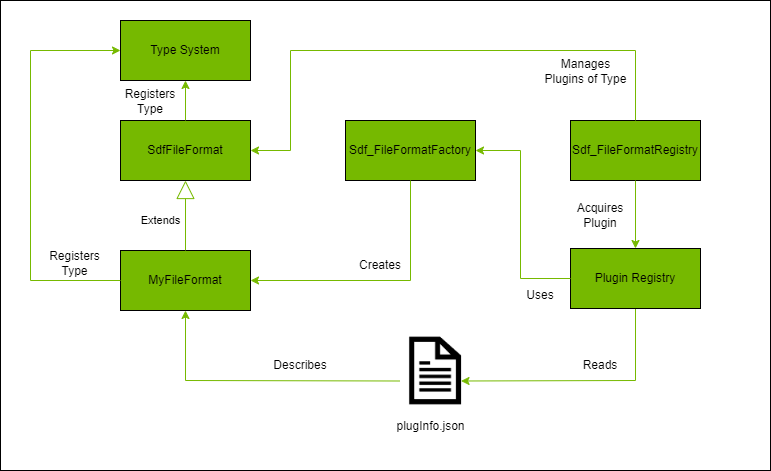

# OpenUSD Plugins

OpenUSD provides many different extensibility points to allow additional data to be represented, loaded, and worked with as prims and attributes within the OpenUSD runtime. These extensiblity points are implemented via _plugins_, which provide definition of additional data (schemas) and certain runtime behaviors (data loading and asset resolution). Plugins are implemented via libraries that contain classes that implement base APIs provided by OpenUSD to interact with the OpenUSD runtime and declared to OpenUSD via information contained in a `plugInfo.json` file.

In general, the plugin system of OpenUSD works in the same way regardless of plugin type. OpenUSD needs a few things for the plugin system to work:

- An abstract base class declaring the API for the plugin type that is registered with the type system
- A factory function for creating new instances
- A mechanism for loading the plugin into the system

For example, in the case of implementing a custom file format extension, OpenUSD provides:

- An abstract base class via `SdfFileFormat`
- A factory object responsible for creating instances of the plugin type via `Sdf_FileFormatFactory`
- An object that reads information of plugins that implement `SdfFileFormat` and loads them into the runtime via `Sdf_FileFormatRegistry`

This can be illustrated in the diagram below:

To implement a plugin, a developer needs to do a few things:

- Create a class that implements the API of the abstract base class
- Register the type with `Tf`
- Declare the plugin and the information contained therein in a `plugInfo.json` file
- Register the plugin with the system (either implicitly by specifying a path to the `plugInfo.json` file in `PXR_PLUGINPATH_NAME` or explicitly via a `RegisterPlugins` call in controlling code)

From the point of view of the OpenUSD runtime, plugins are read generically by interpreting the `plugInfo.json` file and deriving information about the plugin that can be used to load the plugin into the runtime when requested. This is the responsibility of the `plug` OpenUSD library. The metadata of all plugins (regardless of type) is held in the `PlugRegistry` object. On OpenUSD runtime startup, the information in all `plugInfo.json` files accessible from paths declared in `PXR_PLUGINPATH_NAME` are loaded, interpreted, and stored in the `PlugRegistry` singleton instance. Additionally, any `plugInfo.json` files that are found via a `RegisterPlugins` call on the singleton are loaded, interpreted, and stored (more on this later, because order of operations is important!). The metadata of each plugin is represented by a `PlugPlugin` instance.

Objects that are interested in plugins of a certain type may query the `PlugRegistry` for all plugins that derive from a type registered in the type system via a call to `GetAllDerivedTypes`. This returns all registered types that derive from the requested type; from this the object can get the actual plugin metadata via a call to `GetPluginForType`. Finally, the object can load the plugin from the metadata via `Load` in order to work with the specific API implemented by the plugin. This loads the library associated with the plugin into memory and makes the types in it accessible to the system. In general, the objects that manage this information are specific for a particular plugin type (e.g. `SdfFileFormat`) and are typically singletons in the OpenUSD runtime (e.g., `Sdf_FileFormatRegistry`).

The file format objects that implement the OpenUSD plugin architecture for `SdfFileFormat` are given below:

In all cases, the singleton objects that load plugins do so __once__ at the time of first access and cache that information. __This means that any code that performs a call to `RegisterPlugins` must be executed prior to the first call to the singleton object managing plugins of that type!__.

For illustrative purposes, the [`edf` file format plugin](../src/usd-plugins/fileFormat/edfFileFormat) contained within this sample also has an example of a type that manages plugins (of type `IEdfDataProvider`) in a similar way that the built-in OpenUSD managers manage their own plugin types.
